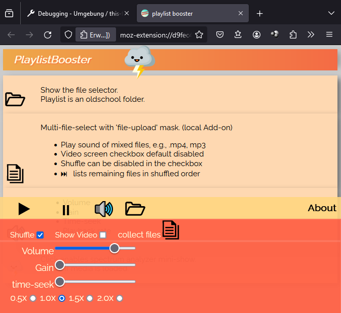

Playlist Shuffle Booster [Volume Gain]
======================================

Overview
---------
This repository shows the source code of a browser add-on.

* Shuffle and play a media file folder
* Play browser supported media files. mp4, aac, mp3, ogg, flac, wbem, wav, ...
* Gain booster runs Bluetooth ear buds

HowTo
-----
Start screen shows instructions

.. image:: ./start.png
            :alt: start screen
            :class: with-border
            :height: 590

-

-

.. image:: ./sound.png
            :alt: sound files active
            :class: with-border
            :height: 590

-

.. image:: ./video.png
            :alt: video files active
            :class: with-border
            :height: 590

Gain - preamp
--------------
Bring your earbuds to the limit.
Push the preamp to 300%. This feels like 20% louder.

Works with bluetooth headphones!

Known issues
-------------

Contributions
-------------

Pull requests are welcome.
If you want to make a major change, open an issue first to have a short discuss.

Thank you
----------
`YouTube franks laboratory <https://www.youtube.com/results?search_query=franks+laboratory>`_

License
-------
Apache 2.0 License