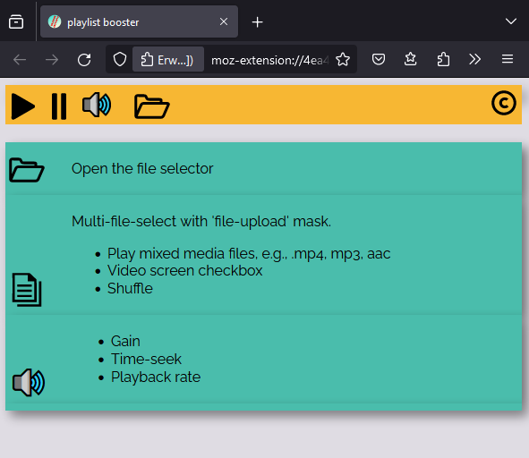
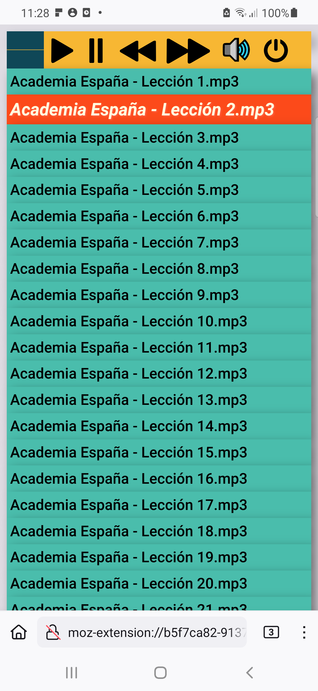
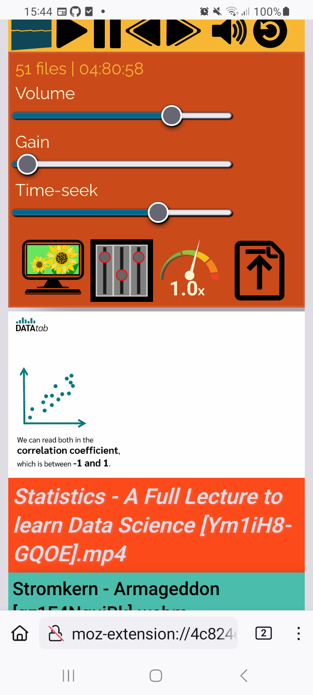

Playlist Booster Shuffle [Volume Gain]
======================================

Overview
---------
This repository shows the source code of a browser add-on.
Runs on FireFox.

* Offline ( Android ) mp3, mp4 video player
* Gain booster, Time-seek and playback rate options 
* Multi-band equalizer
* pdf support

Mozilla Add-on: https://addons.mozilla.org/en-US/firefox/addon/playlistbooster/

ReadTheDocs (code doc): https://playlistbooster.readthedocs.io/en/latest/README.html

Why
---
While working with the multi-file-upload feature, an old school mp3 player appeared in my mind's eye.

How it works
-------------

`manifest.json <https://github.com/44xtc44/PlaylistBooster/blob/dev/manifest.json>`_ The add-on uses browser 'tabs' permission to load a background script, which opens the HTML page.

`background.js <https://github.com/44xtc44/PlaylistBooster/blob/dev/background.js>`_ Loads the HTML page, which loads the JavaScript scripts.

`index.js <https://github.com/44xtc44/PlaylistBooster/blob/dev/static/js/index.js>`_ - DOM Audio, video context and element creation.

`playlist.js <https://github.com/44xtc44/PlaylistBooster/blob/dev/static/js/playlist.js>`_ - Multi-file-upload feature creates a playlist. Forward and backward buttons are disposable to get rid of the event listener in case of a new playlist creation.

Favicon (rotating default_icon) and buttons are SVG files created with Inkscape.

Spectrum analyzer reads data from 'analyserNodeTwo' and is is driven by 'requestAnimationFrame'.

'analyserNodeOne' will be used by a bigger analyzer show in the future.

HowTo PC
--------
Clone the repo. 

FireFox 'about:debugging', and 'this FireFox' select a new temporary Add-on.

Open the PlaylistBooster manifest.json and then start the Add-on from the puzzle icon list.

HowTo Android
--------------
Clone the repo. 

Install 'web-ext' "https://extensionworkshop.com/documentation/develop/developing-extensions-for-firefox-for-android/".

Install Android Studio latest and create a dummy project. The device manager is needed to run a Android Virtual Device (AVD).

You then want to download the FireFox apk file and drag it onto the AVD. 
Search "Firefox Nightly for Developers". If you find 'APKmirror' save, go there. Else use the registration
process to enable PlayStore to pull FireFox Nightly, into every AVD.

.. note::
    Deinstall FireFox 'regular' version, if any.

Open a terminal in the root of the repo clone, to load the Add-on into the AVD via USB.

.. code-block:: console

    @PlaylistBooster$ adb devices -l
    List of devices attached
    emulator-5554   offline

    @PlaylistBooster$ web-ext run --target=firefox-android --android-device emulator-5554 --firefox-apk org.mozilla.fenix

The AVD and FireFox Nightly must be USB enabled (Dev mode) then.

Drag some media files into 'Device Explorer' in 'Android Studio'. Use 'mnt/sdcard/Music', to see it in user view on AVD.

-

-

Gain - preamp
--------------
Bring your earbuds to the limit.
Push the preamp to 500%. This feels like 20% louder.

Works with bluetooth headphones!

Known issues
-------------
FireFox for Android looses file collection object  
^^^^^^^^^^^^^^^^^^^^^^^^^^^^^^^^^^^^^^^^^^^^^^^^^^
(A) FF video element 
will stop playing at all, if the PlaylistBooster tab is in the 
background and you want to bring it to the foreground.

(B) FF video element
will stop playing if the PlaylistBooster tab is in the 
background and you open another website.

Temporary solution: Press app reload button.

FireFox for Android Add-on not visible (DEV)  
^^^^^^^^^^^^^^^^^^^^^^^^^^^^^^^^^^^^^^^^^^^^^
FireFox Nightly MUST have an open tab (i.e wikipedia) 
before you can see/click the ( <temporay> web-ext ) Add-on in the Extension bar.

Contributions
-------------

Pull requests are welcome.
If you want to make a major change, open an issue first to have a short discuss.

Thank you
----------
`YouTube franks laboratory <https://www.youtube.com/results?search_query=franks+laboratory>`_

License
-------
Apache 2.0 License