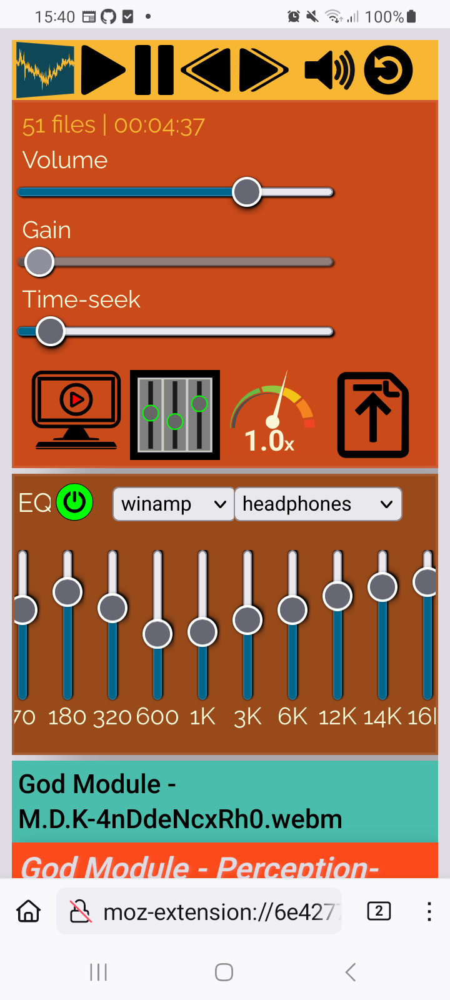

Playlist Shuffle Booster [Volume Gain]
======================================

Overview
---------
This repository shows the source code of a browser add-on.

* Shuffle and play a media file folder
* Play browser supported media files. mp4, aac, mp3, ogg, flac, wbem, wav, ...
* Gain booster runs Bluetooth ear buds

HowTo
-----
Start screen shows instructions

.. image:: ./start.png
            :alt: start screen
            :class: with-border
            :height: 590

-

.. image:: ./options.png
            :alt: show options
            :class: with-border
            :height: 590

-

-

.. image:: ./video.png
            :alt: video files active
            :class: with-border
            :height: 590

Gain - preamp
--------------
Bring your earbuds to the limit.
Push the preamp to 300%. This feels like 20% louder.

Works with bluetooth headphones!

Known issues
-------------

Contributions
-------------

Pull requests are welcome.
If you want to make a major change, open an issue first to have a short discuss.

What can be done?

* add a switch for language, class with lists to update DOM elements text
* global switch for better/custom designs, class to instaniate new designs
* centralize the design to host options at all
* options for manual input playback rate
* options for custom analyzer, write an analyzer
* options for canvas with healing 2D or 3D animations
* sound detection (browser sound API) to stear/load 2D, 3D animations
* options bar for equalizer, store preferences in DB or cookie
* cookie API for others to add cookies for night mode, design, language
* sqlite db to store preferences, can have cookies beside because we want to learn (can ask user)
* refactor the app to split it into components (folders)
* refactor to implement TypeScript
* refactor for Java docstrings
* implement Jest testing rules via .md or .rst document
* write tests with Jest
* write a "dead simmple" 'HowTo Contribution for NewBees' for the documentation (can have any form, will be integrated in docu)
* write the rules and/or documentation for readthedocs.io (java docstrings?)
* Add a "What can be done" idea hereby

Accept pull requests will be honored by mention the requesters here. (one more link for a potential employee to your entry here)

Thank you
----------
`YouTube franks laboratory <https://www.youtube.com/results?search_query=franks+laboratory>`_

License
-------
Apache 2.0 License